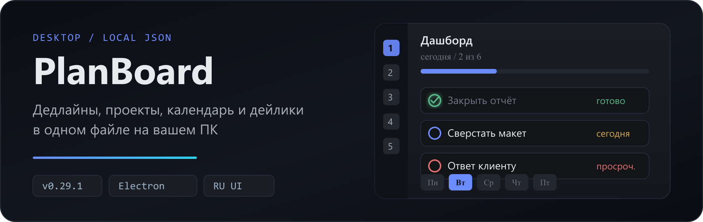
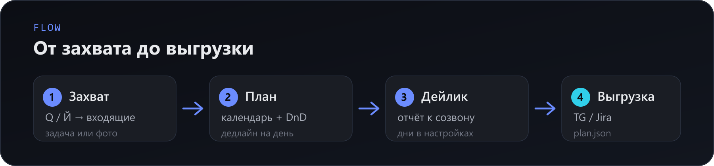
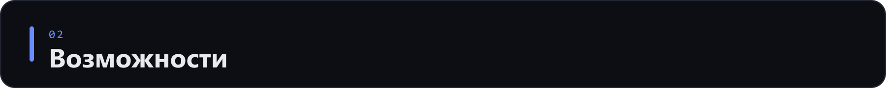
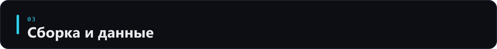

<p align="center">
  
</p>

<p align="center">
  
</p>

**PlanBoard** — локальный планировщик для Windows. Дедлайны, проекты, календарь и дейлики живут в одном `plan.json` на вашем компьютере. Интерфейс на русском. Облако не требуется.

**Стек:** React 19 · TypeScript · Vite · Zustand · **Electron**  
**Версия:** v0.30.3 — см. [ROADMAP.md](./ROADMAP.md)
**Следующий релиз:** [v0.31](./ROADMAP.md#v031--оптимизация-меню-навигации) — оптимизация меню.

> Десктоп на **Electron**. Legacy Tauri (`src-tauri/`) удалён в v0.29.3.

<p align="center">
  
</p>

---

<p align="center">
  
</p>

### Уже есть собранный .exe

Двойной клик по **`PlanBoard.cmd`** или:

```
dist-electron\PlanBoard 0.29.3.exe              ← portable
dist-electron\win-unpacked\PlanBoard.exe       ← распакованная версия
dist-electron\PlanBoard Setup 0.29.3.exe        ← установщик
```

### Разработка (окно приложения)

```powershell
cd путь\к\PlanBoard
pnpm install          # обязательно после clone / смены ветки
pnpm rebuild electron # первый раз или после обновления electron
pnpm electron:dev
```

Данные: `%APPDATA%\PlanBoard\plan.json`

### Только браузер (быстрая проверка UI)

```powershell
pnpm dev
```

→ http://127.0.0.1:5173/  
При `pnpm dev` данные тоже в `%APPDATA%\PlanBoard\plan.json` (через dev API на `127.0.0.1`).  
Любой локальный процесс может читать/писать план, пока крутится Vite — не оставляйте `pnpm dev` на чужой машине.

### Команды

| Команда | Что делает |
|---------|------------|
| `pnpm install` | Зависимости (после clone) |
| `pnpm rebuild electron` | Бинарник Electron |
| `pnpm electron:dev` | Окно приложения + hot reload |
| `pnpm dev` | Только Vite в браузере |
| `pnpm electron:build` | Собрать .exe → `dist-electron\` |
| `pnpm build` | Фронтенд в `build\` |
| `pnpm test` | Автотесты ≈ **330** (+ stabilize) |
| `pnpm lint` | oxlint |

**Двойной клик (Windows):** `PlanBoard.cmd` · `Build-Electron.cmd`  
**Терминал:** PowerShell или cmd. Для `electron:build` **не Git Bash**.

---

<p align="center">
  
</p>

### Вкладки `1`–`8`

| Клавиша | Вкладка |
|---------|---------|
| `1` | **Дашборд** — просроченные, сегодня, 7 дней |
| `2` | **Повестка** — задачи на дату, зачёт «не в срок» |
| `3` | **Календарь** — неделя / месяц / квартал / год, DnD |
| `4` | **Входящие** — без даты, быстрый захват |
| `5` | **Дейлик** — отчёт к созвону (дни настраиваются) |
| `6` | **Задачи** — список и фильтры |
| `7` | **Проекты** — цвета, «Завершить» / архив |
| `8` | **История** — выполненные по датам |

### Рядом с доской

- **Быстрый захват** — `Q` / `Й` (можно только фото)
- **Фото** — `Ctrl+V`, drag-and-drop, лайтбокс
- **Минимальное окно** — ⚙ → Режим окна; позиция запоминается отдельно
- **Текст TG** — `Ctrl+Shift+C` (период, сделанное, inbox)
- **Jira** — создать задачу в Jira Cloud (только Electron)
- **Голос** — `Ctrl+Shift+V` (включается в настройках)
- **Темы** — светлая / тёмная / системная; палитры + «Моя тема»
- **Праздники РФ** — производственный календарь 2025–2027
- **Прогресс дня** — полоса на дашборде, в повестке и в шапке

### Горячие клавиши

| Клавиша | Действие |
|---------|----------|
| `N` | Новая задача |
| `1`–`8` | Вкладки |
| `Q` / `Й` | Быстрый захват |
| `Ctrl+S` | Сохранить |
| `Ctrl+E` | Экспорт JSON |
| `Ctrl+F` | Поиск |
| `Ctrl+Shift+C` | Текст для Telegram |
| `Ctrl+V` | Вставить фото |
| `Ctrl+Shift+V` | Голосовой ввод |
| `Пробел` | Отметить задачу |
| `Esc` | Закрыть форму |

---

<p align="center">
  
</p>

### Сборка .exe

```powershell
pnpm electron:build
```

Перед упаковкой: `pnpm build` → strip icon sources → verify icons → electron-builder  
(копия в `dist-electron\`, обход EPERM через временную папку).

**Если `EPERM`:** закройте PlanBoard → удалите `dist-electron` → PowerShell → при необходимости исключение в антивирусе.

**Visual Studio / Rust не нужны.**

<details>
<summary>Иконки и пути данных</summary>

| Путь | Назначение |
|------|------------|
| `public/icons/wordmark/{palette}.png` | Логотип сайдбара |
| `public/icons/views/{palette}/` | Иконки вкладок |
| `public/icons/ui/{palette}/` | UI-иконки |
| `resources/icon.png` | Иконка .exe (512px) |

Замена логотипа: `wordmark/{palette}-source.png` → `pnpm icons` → `pnpm electron:build`.

| Режим | Данные |
|-------|--------|
| Electron / `pnpm dev` | `%APPDATA%\PlanBoard\plan.json` |
| Статический preview | `localStorage` → `planboard-plan` |
| Фото | `%APPDATA%\PlanBoard\attachments\{taskId}\` |
| Бэкап | `plan.json.bak` |
| Окна | `window-layouts.json` |

Данные **не стираются** при пересборке .exe.

</details>

<details>
<summary>Формат plan.json (сокращённо)</summary>

```json
{
  "version": 1,
  "settings": {
    "theme": "system",
    "colorPalette": "plain",
    "defaultView": "dashboard",
    "windowMode": "standard",
    "daily": { "enabled": true, "days": [1, 4] },
    "jira": { "enabled": false }
  },
  "projects": [{ "id": "uuid", "name": "Работа", "color": "#4fc3f7", "completed": false }],
  "tasks": [{
    "id": "uuid",
    "title": "Задача",
    "deadline": "2026-07-05",
    "priority": "medium",
    "status": "todo",
    "attachments": []
  }]
}
```

</details>

### Jira (опционально)

1. ⚙ **Настройки** → Интеграции → Jira  
2. URL, email, [API Token](https://id.atlassian.com/manage-profile/security/api-tokens), ключ проекта  
3. В форме задачи — **→ Создать в Jira**

Только Electron (CORS в браузере).  
API token хранится в `plan.json` локально; в JSON-экспорт токен **не попадает** (redact с v0.29.2).

---

## Структура проекта

```
PlanBoard/
├── electron/          # main, preload, IPC
├── src/               # React UI, Zustand, lib
├── scripts/           # build, icons, verify-*
├── public/icons/      # палитры, views, ui
├── resources/         # icon.png для .exe
├── assets/readme/     # SVG для этой страницы
├── build/             # фронтенд после сборки
└── dist-electron/     # готовые .exe
```

## Требования

- [Node.js](https://nodejs.org/) 18+
- [pnpm](https://pnpm.io/) 10+

## Частые проблемы

| Проблема | Решение |
|----------|---------|
| `cargo` / `tauri:build` | Tauri удалён → `pnpm electron:build` |
| Git Bash / EPERM | PowerShell + закрыть приложение |
| Порт 5173 занят | Закройте старый `pnpm dev` |
| `Cannot find package 'rolldown'` / `sharp` | `pnpm install` |
| Electron не стартует | `pnpm rebuild electron` |
| Голос не работает | F12 → `[Voice]`, разрешите микрофон |
| Иконки не в .exe | `pnpm icons` → `pnpm electron:build` |

## Качество и план

| | |
|--|--|
| **Версия** | **v0.30.3** — реструктуризация настроек |
| **Дальше** | **v0.31** меню. Анимации фона — **v0.35**, в конце очереди |
| **Тесты** | `pnpm test` — verify-скрипты + календарь РФ |
| **Чеклист** | [`TESTS.md`](TESTS.md) |
| **План** | [`ROADMAP.md`](ROADMAP.md) |

<details>
<summary>Очередь релизов и покрытие тестов</summary>

| Релиз | Суть |
|--------|------|
| **v0.29.2** ✅ | Стабилизация (данные, Jira, normalize, Electron) |
| **v0.29.3** ✅ | Perf + гигиена (`src-tauri/` удалён, CI) |
| **v0.30.1** ✅ | Черновики форм |
| **v0.30.2** ✅ | Прогресс дня — явные % |
| **v0.30.3** ✅ | Реструктуризация настроек |
| **v0.31** | Оптимизация меню |
| **v0.31.1** | Скрываемое меню |
| **v0.32** | Мобильное приложение |
| **v0.33** | Группировка в дейлике |
| **v0.34** | Ollama |
| **v0.35** | Анимации фона 2.0 (конец очереди) |

| Скрипт | Проверок |
|--------|----------|
| `verify-daily-meetings.mjs` | 49 |
| `verify-attachments.mjs` | 12 |
| `verify-month-calendar.mjs` | 9 |
| `verify-holiday-labels.mjs` | 22 |
| `verify-projects.mjs` | 5 |
| `verify-palettes.mjs` | 91 |
| `verify-export-text.mjs` | 3 |
| `verify-settings-ui.mjs` | 91 |
| `verify-task-credit.mjs` | 12 |
| `verify-day-progress.mjs` | 11 |
| `verify-minimal-window.mjs` | 30 |
| `verify-stabilize.mjs` | ~20 |

</details>

## Лицензия

MIT
